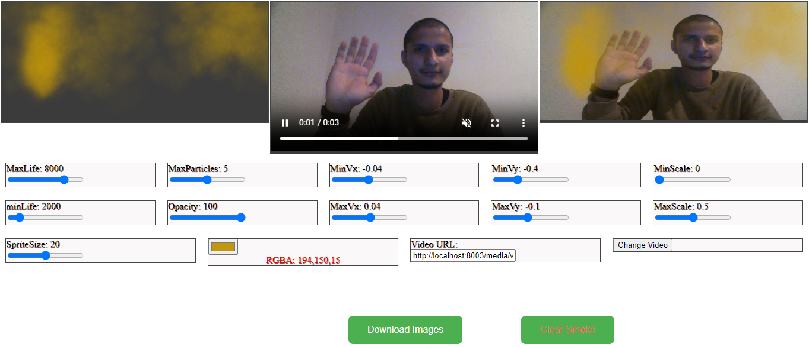
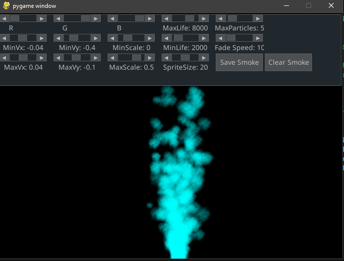
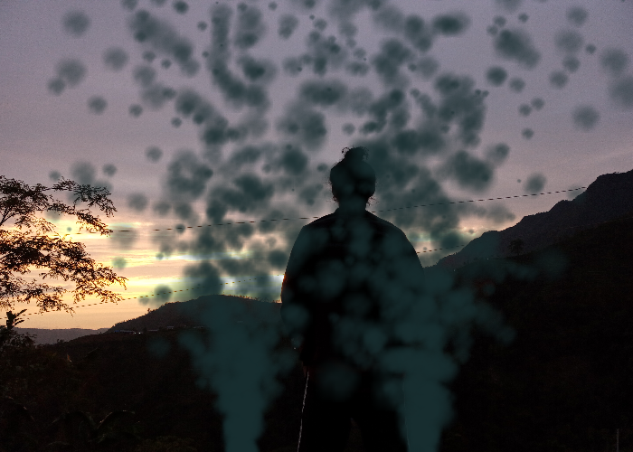

# Smoke Simulation: Experiments in Generating and Augmenting Smoke


[](https://coveralls.io/github/q-viper/SmokeSim?branch=master)


This project showcases my experiments in simulating smoke effects using both **JavaScript** and **Python**. The project utilizes and extends two open-source libraries to demonstrate smoke generation in various contexts, including interactive demos, image augmentation, and video processing.

## Disclaimer
This project is an educational exploration, and I am not an expert in JavaScript. The implementation builds on the following two projects, which have been modified to suit the goals of this project:

- [`pages/scripts/smoke.js`](pages/scripts/smoke.js): Adapted from [bijection/smoke.js](https://github.com/bijection/smoke.js)
- [`pages/scripts/processor.js`](pages/scripts/processor.js): Based on [processor.js](https://github.com/mdn/dom-examples/blob/main/canvas/chroma-keying/processor.js)

**Credits:** A huge thanks to the original authors for their incredible work.


## Why am I doing this?

<details>
  <summary>Click to expand</summary>
  
  ### **Short Answer**  
  For fun!

  ### **Long Answer**  
  As an engineer working on computer vision applications, I frequently need to train models in diverse environments. One challenging scenario is generating realistic smoky environments, which are difficult to replicate in real-time, especially when high-quality, dynamic simulations are needed for training. 

  To solve this problem, I created this tool to simulate smoke effects and integrate them into various projects—whether for training models or enhancing visual effects. This solution allows for more control, flexibility, and realism when simulating smoke, and it's fun to build and experiment with!

</details>

## Use Cases

<details>
  <summary>Click to expand</summary>

  ### **Smoke Overlaying**  
  For the vision applications running in smokey environment, this tool can generate smokey frames on demand by overlaying smoke on a single clean image. 

  ### **Smoke Segmentation**  
  This might not be that important but I was trying to build a model that could reconstruct a clean image from a smokey one and I used the segmentation mask and history generated from this tool in that project.
</details>

## Installation
1. `git clone https://github.com/q-viper/SmokeSim.git`
2. `cd SmokeSim`
2. `pip install .`

Please make an issue if it failed.

---

## Demos 
### JavaScript Version

This demo showcases real-time smoke effects on a web-based canvas:
- **Interaction:** Hover and click on the rightmost canvas to observe smoke movement.
- **Customization:** UI elements allow tweaking of smoke parameters.

#### How to Run:
1. Clone this repository.
2. Start a local HTTP server in the project directory to avoid CORS errors. For example:
   ```bash
   python examples/server.py
   ```
(This uses [`examples/server.py`](examples/server.py) adapted from this [gist](https://gist.github.com/acdha/925e9ffc3d74ad59c3ea#file-simple_cors_server-py).) 
3. Navigate to http://localhost:8003/js_demo/index.html.

#### Preview:



### PyGame Version

This demo uses PyGame to simulate smoke effects with interactive mouse controls:
- **Left Click:** Add new smoke particles.
- **Right Click:** Clear the canvas and add new smoke.
- **Hover:** Apply wind effects to influence smoke direction.

#### Preview:


#### How to Run:
1. Execute the following command:
```bash
   python particle.py
```

## Using this for Image Augmentation
This project also supports generating smoke effects for use in image augmentation. The `smokesim` Python module allows for realistic smoke overlays on static images.

### Example:

```python
from smokesim.augmentation import Augmentation

import numpy as np
from pathlib import Path

if __name__ == "__main__":
    np.random.seed(100)
    WIDTH, HEIGHT = 700, 500
    augmentation = Augmentation(image_path=None, screen_dim=(WIDTH, HEIGHT))
    smoke_machine = augmentation.smoke_machine
    augmentation.add_smoke(dict(particle_count=15, sprite_size=25, origin=(250, 500)))
    augmentation.add_smoke(dict(particle_count=15, sprite_size=25, origin=(450, 500)))

    augmentation.augment(steps=90,history_path=Path('media/smoke_history.mp4'))
    for i in range(5):
        augmentation.add_smoke(
            dict(
                color=smoke_machine.color,
                particle_count=1,
                origin=(np.random.randint(100, WIDTH), np.random.randint(100, HEIGHT)),
                lifetime=200,
                particle_args={
                    "min_lifetime": 200,
                    "max_lifetime": 500,
                    "min_scale": 10,
                    "max_scale": 50,
                    "fade_speed": 50,
                    "scale": 50,
                    "smoke_sprite_size": 50,
                    "color": smoke_machine.color,
                },
            )
        )
    augmentation.augment(steps=1)
    augmentation.save_as('assets/augmented_smoke_image.jpg')
    augmentation.end()

```

* A better example is at [`examples/image_augmentation.py`](examples/image_augmentation.py). 
* Now `augment` method also accepts image where we want to put smoke. It should be NumPy array. And returns same image after augmenting it. And we can store the smoke history as well. 
* A sample can be seen at [media/smoke_history.mp4](https://q-viper.github.io/SmokeSim/media/smoke_history.mp4).

### Preview



## Using this With Video
* [`examples/video_augmentation.py`](examples/video_augmentation.py) contains a cool project with MediaPipe (installation is required first: `pip install mediapipe==0.10.14`). Where smoke is generated on the forefinger's position. 
* Demo is at [media/smoke_video.mp4](https://q-viper.github.io/SmokeSim/media/smoke_video.mp4).


## To do
* Add collision effect between particles.
* Add wind effect.
* Try to add smoother transition.

## Collaborating
If you find this project to be interesting and want to add changes, please add your changes and make the push request. Or you can make an issue for that.