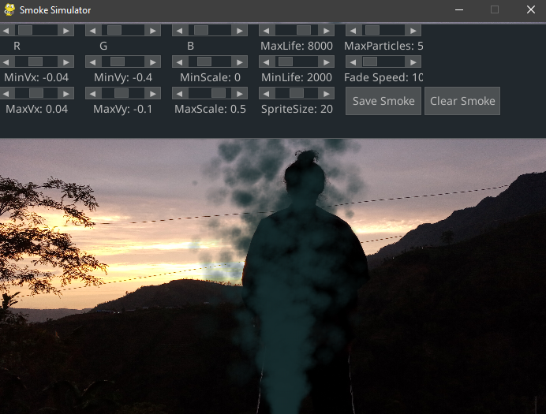

# Smoke Generation
Just some experiments while I am learning about smoke generation and simulating things. Demo: [pages/index.html](pages/index.html). Just move cursor on **Right canvas to see smoke effect**. Video might not play on demo server. But smoke does :)

## Disclaimer
I am no expert in JS and this project uses modified version of following two projects:
* [pages/scripts/smoke.js](pages/scripts/smoke.js) from: [bijection/smoke.js](https://github.com/bijection/smoke.js/)
* [pages/scripts/processor.js](pages/scripts/processor.js) from: [processor.js](https://github.com/mdn/dom-examples/blob/main/canvas/chroma-keying/processor.js)

**Huuuuuuuuuuge credit goes to original authors.**

## Demo 
### JavaScript Version
* On rightmost panel where video is being re-played, we can perform hover, click action to see smoke movement.
* Tweaking UI elements also works.

#### What to do?
1. Clone this.
2. Start a localhost server (on this dir) to avoid CORS Errors. I am using [server.py](server.py) taken from [here](https://gist.github.com/acdha/925e9ffc3d74ad59c3ea#file-simple_cors_server-py). 
3. Open http://localhost:8003/pages/index.html and see it for yourself.

### PyGame Version
* Left click to **add** new smoke.
* Right click to **clear and write** new smoke.
* Hover to see wind effect.

#### What to do?
* Run `particle.py` and TADAAAAAAAAAA!

## To do
* Add collision effect.
* Add wind effect.
* Make it smooth.